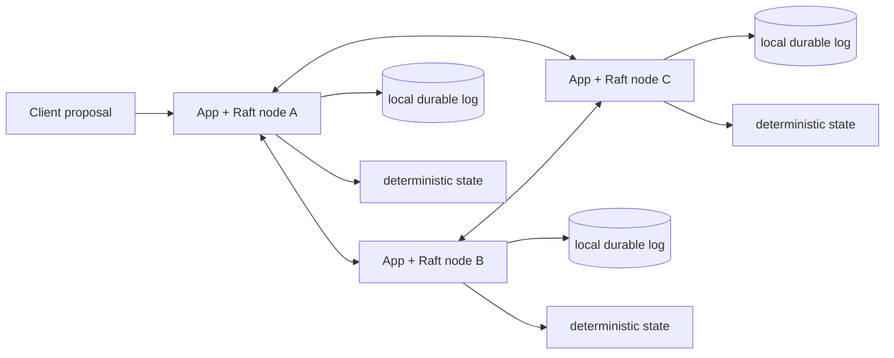

# node-raft-rsm

> Experimental — a TypeScript-first embeddable Raft engine for replicated state machines in Node.js. It is not production-ready; the durable adapter, snapshot pipeline, and full fault matrix are still incomplete.

`node-raft-rsm` is for processes that each own a local state-machine replica and must agree on one ordered command stream. Ordinary stateless APIs backed by an authoritative shared database generally do not need embedded Raft: the database already supplies consistency and the application tier can remain replaceable.

Good fits include replicated schedulers, metadata services, coordination systems, configuration stores, control planes, and research tools. It is not a general HA wrapper, an etcd client, a cache coherence system, or a transparent distributed-transaction layer.

## Current guarantees and boundaries

The implemented slice provides deterministic elections, RequestVote, AppendEntries/heartbeats, log conflict repair, quorum commitment with the current-term restriction, persist-before-send Ready processing, ordered local apply, explicit local reads, command IDs, and in-memory fault controls. Raft does not provide Byzantine safety, exactly-once external side effects, arbitrary memory synchronization, or transparent transactions. Linearizable reads are not exposed.



The command lifecycle is `propose → append → persist → replicate → quorum → commit → apply → return result`. A command is never applied before consensus.

## Development setup

Node 24 LTS and pnpm 9 are the current development baseline. This workspace has not been published; use workspace package names only.

```sh
nvm use
pnpm install
pnpm check
pnpm example:kv
```

The public shape is centered on `RaftNode.create`, `node.start()`, `node.propose(command, { commandId, timeoutMs })`, and `node.read(reader, { consistency: 'local' })`. See the tested [replicated KV state machine](./examples/replicated-kv/src/state-machine.ts) and the [state-machine contract](./docs/state-machine-contract.md). A proposal resolves after the local state machine applies the committed entry. Timeout is ambiguous: retry the identical bytes with the same command ID.

Each member needs independent local durable storage. A vote or successful append response must not leave the process until the corresponding term/vote/log changes are durable. Snapshot restore must complete before later entries are replayed. These contracts are explained in [storage and durability](./docs/storage-and-durability.md) and [snapshots](./docs/snapshots.md).

Only explicitly stale-capable local reads exist today. “This process thinks it is leader” is not enough for linearizability; ReadIndex/quorum confirmation is roadmap work.

## Status and operations

`pnpm example:kv` runs a deterministic three-node memory-backed cluster, commits KV commands, and verifies converged state hashes. The planned HTTP/Docker failover exercise is not yet shipped. Kubernetes deployments must use stable identities and one persistent volume per fixed member; see [Kubernetes guidance](./docs/kubernetes.md). The [testing strategy](./docs/testing-strategy.md) distinguishes current evidence from the required simulator and integration matrix.

Review the candid [limitations](./docs/limitations.md), [roadmap](./docs/roadmap.md), [architecture](./docs/architecture.md), [contributing guide](./CONTRIBUTING.md), and [security policy](./SECURITY.md) before adopting the code.

## License

No license has been selected because repository ownership and licensing authority were not provided. This must be resolved before distribution or contribution acceptance.
