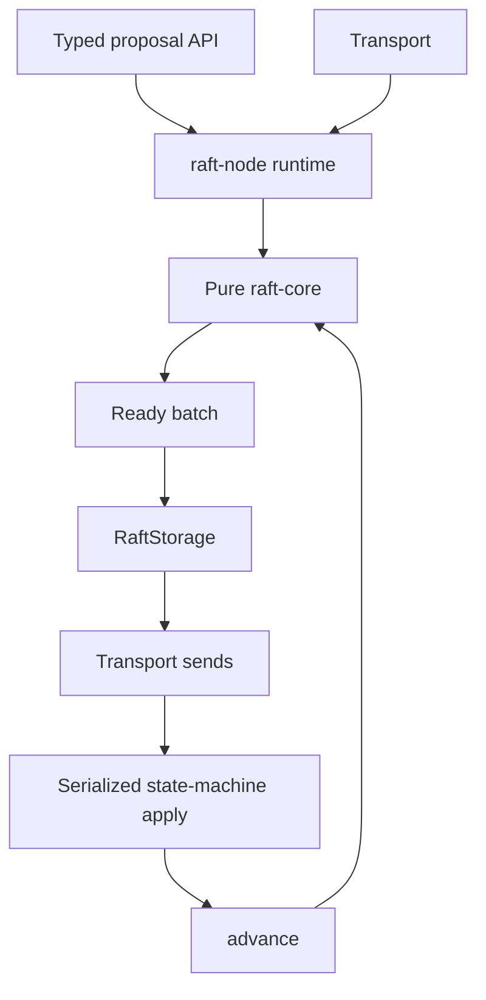
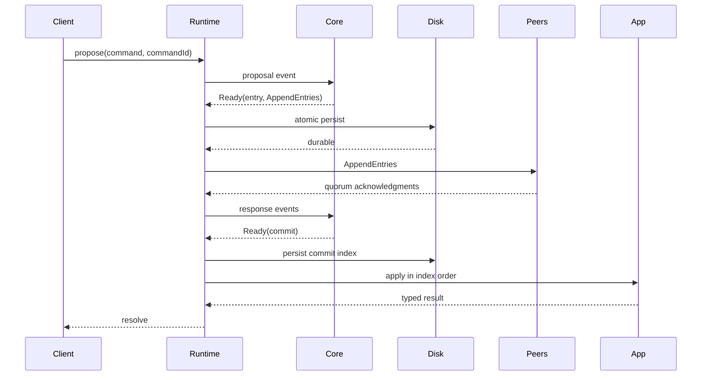

# Architecture

`raft-core` is a deterministic transition engine. It owns roles, terms, votes, log matching, peer progress, and commitment, but imports no timers, network, filesystem, or database. `raft-node` owns lifecycle and serializes external events. `raft-storage-memory` and `raft-transport-memory` are deterministic adapters. `raft-testing` provides seeded randomness and virtual time. The KV example is application code, not part of consensus.

Every Ready batch is processed conservatively: persist hard state, truncation, entries, and snapshot metadata atomically; await durability; send messages; apply committed entries in index order; persist the applied position; advance the core. Vote grants and successful append acknowledgments share that barrier.

Recovery loads hard state, snapshot metadata/data, log entries, and applied position before constructing the core. Snapshot restoration precedes later replay. Full replay and durable deduplication are not implemented yet and remain release blockers.
